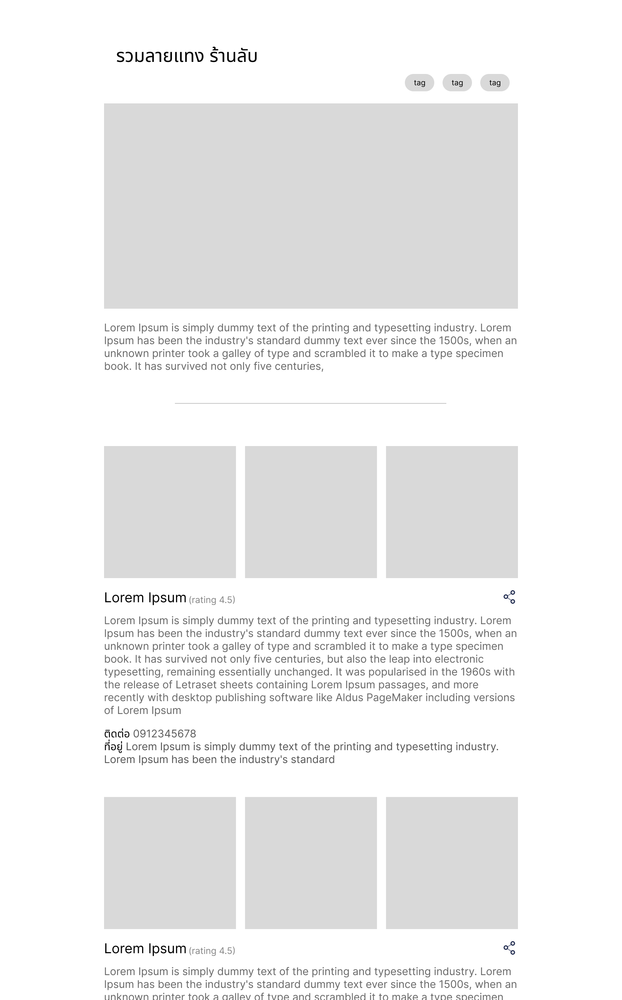

# Frontend Assignment 2025 - Guide to Hidden Gems

[เวอร์ชันภาษาไทย](./README.md)

In this assignment, you need to create a web application "Guide to Hidden Gems", a collection of restaurants designed to help users easily discover places that fit their needs.

**This assignment must be completed within 7 days from the date you receive the email.**

## Prerequisites

Prepare your development environment with the following checklist

- Code editor ([VS Code](https://code.visualstudio.com/), [Cursor](https://cursor.com/) recommended)
- Node.js v20 or later (recommended to install via a version manager such as [์NVM](https://github.com/nvm-sh/nvm))

## Tasks

The "Guide to Hidden Gems" Web Application consists of 3 components

1. Data Server - A data repository for collecting all guide and restaurant data (already prepared for you)
2. API Gateway - An intermediary that aggregates data from services and provides it to the web app
3. Web - A web interface for displaying the UI

For this assignment, you need to develop 2 parts: **the API Gateway** and **the Web Application**.

### 1. API Gateway

`At LINE MAN Wongnai, frontend developers sometimes also create API Gateways in addition to building web apps.`

In this task, you need to create an API Gateway Server that **collects data from the provided data server** (the data server will be discussed in the next section)

**API Gateway can use any language, framework, and tools according to your preference**

#### Requirements

- [ ] Create endpoints that aggregate and return data to the web app, considering various errors that may occur
- [ ] Write unit tests to ensure that the API Gateway can work correctly

### 2. Web

`Building web applications is the main responsibility and passion of frontend developers at LINE MAN Wongnai`

In this task, you need to create a React web application to display restaurant guides, making it easy for users to search for restaurants of interest.



> "Going to travel to Kanchanaburi, want to know what restaurants are worth visiting around there"

> "I heard that matcha is currently trending on social media, let me see what matcha shops are worth visiting, preferably specialized shops"

> "Going to treat juniors, which restaurant can accommodate many people"

**The Web Application must be written with React and TypeScript, and you can choose to use other libraries according to your preference**

#### Requirements

Create a web application that connects to the API Gateway to display restaurant guides **considering good UX and UI for users**, making users feel that using our web is more convenient and faster.

In restaurant guides, there are mainly 2 essential features: Guide Detail and Guide Restaurant

**Guide Detail**

- [ ] **Guide title**
- [ ] **Description** - explains what the guide is about and what kinds of restaurants it includes
- [ ] **Tags** - relevant keywords for the guide
- [ ] **Cover image** - cover image for the guide

**Guide Restaurant**

- [ ] Restaurant images
- [ ] Restaurant name
- [ ] Description about this restaurant
- [ ] Restaurant address
- [ ] Contact information
- [ ] Rating / number of stars
- [ ] Restaurant categories

Beyond the above features, you may add any other features that improve UX, accessibility, and usability.

**Coding**

- [ ] Write unit tests to ensure the Web application work correctly

## Grading Criteria

Your submission will be evaluated on

- [ ] Website can work correctly according to all the mentioned requirements
- [ ] Website has good UX/UI
- [ ] Proficiency in Javascript, Typescript, and React
- [ ] Good Developer experience maintainable, well-structured code
- [ ] Both frontend (website) and backend (server) systems must have good performance and security

The evaluation criteria may be adjusted at the examiner’s discretion.

## Data Server API Specification

The Data Server is composed of multiple microservices, each responsible for different functions, such as restaurant data and guide data. These services are accessible via REST API calls.
You can view and test the APIs of each service directly through the Swagger Docs provided when running the Data Server (links will be specified for each service).

#### 1. Guide Service

Swagger Docs: http://localhost:8888/ui

Service for storing various guide data

##### 1.1 **Guide List**

For viewing the list of all guides in the system

###### Request

- URL: `localhost:8888/guides`
- Method: `GET`

###### Response

- Type: `application/json`
- Body:

  ```ts
  string[]
  ```

  | Description               |
  | ------------------------- |
  | List of IDs of all guides |

- Example:

  ```json
  [
    "e1bfd2d3-f0fb-470e-bdd3-be884fdd8dfb",
    "34c790dd-123b-499b-ba55-ea2f5befb452"
  ]
  ```

##### 1.2 **Guide Detail**

For viewing guide detail of each guide

###### Request

- URL: `localhost:8888/guides/:id`
- Method: `GET`
- Params:
  - `id`: Guide ID (may be obtained from the `id` of the [Guide List](#11-guide-list) API)

###### Response

- Type: `application/json`
- Body:

  ```ts
  id: string
  title: string
  socialTitle: string
  shortDescription: string
  description: string
  coverPhoto: {
    id: string,
    smallUrl: string
    largeUrl: string
  }
  tags: string[]
  writeDate: string
  createdAt: string
  updatedAt: string
  items: string[]
  ```

  | Field Name            | Description                                                                 |
  | --------------------- | --------------------------------------------------------------------------- |
  | `id`                  | ID of the current guide                                                     |
  | `title`               | Guide title                                                                 |
  | `socialTitle`         | Guide title for use outside the website, such as on social media or for SEO |
  | `shortDescription`    | Short description of the guide                                              |
  | `description`         | Full description of the guide                                               |
  | `coverPhoto`          | Cover image of the guide                                                    |
  | `coverPhoto.id`       | Image ID                                                                    |
  | `coverPhoto.smallUrl` | Small image URL                                                             |
  | `coverPhoto.largeUrl` | Large image URL                                                             |
  | `tags`                | Keywords related to this guide                                              |
  | `writeDate`           | Date this guide was written                                                 |
  | `createdAt`           | Date this guide was created in the database                                 |
  | `updatedAt`           | Date this guide was last modified                                           |
  | `items`               | List of IDs of all "guide items" in this guide                              |

- Example:

  ```json
  {
    "id": "e1bfd2d3-f0fb-470e-bdd3-be884fdd8dfb",
    "title": "10 คาเฟ่ลับ One Bangkok!",
    "socialTitle": "ไม่อยากจะเชื่อ มีร้านคาเฟ่ดี ๆ แบบนี้ห้างดังย่านลุมพินี One Bangkok ด้วย",
    "shortDescription": "รวมคาเฟ่เด็ดที่ One Bangkok",
    "description": "รวมสุดยอดคาเฟ่ลับ ที่จะพาคุณไปหลงทาง เอ้ย! หลงไหล ในกลิ่นกาแฟอันหอมหวน และ บรรยากาศร้านติดแกรม กินแล้วจะติดใจ",
    "coverPhoto": {
      "id": "63ce2123-b49a-49cc-bc13-80ed802a7894",
      "smallUrl": "http://localhost:7777/r/854/480/20240902_091058.jpg",
      "largeUrl": "http://localhost:7777/r/1920/1080/20240902_091058.jpg"
    },
    "tags": ["กาแฟ", "คาเฟ่", "กรุงเทพ", "One", "Bangkok"],
    "writeDate": "2024-03-10T12:00:00.000Z",
    "createdAt": "2024-03-10T12:00:00.000Z",
    "updatedAt": "2024-03-10T12:00:00.000Z",
    "items": [
      "c77c4d6c-01fa-4e62-8870-563de216a976",
      "a213d622-6649-45b2-9857-ce7f81581256",
      "fed2219f-6dc3-4191-a29d-dd1a15f524ee",
      "da79ad80-6cc0-484d-a574-a84151aba3ef",
      "0209bd16-ca21-4e7f-97e5-888dc20b2896",
      "3cef2b8f-e73e-40d4-9ca5-41fc5b15ca42",
      "9e4ae89a-fd31-4ee0-9378-1d52fb9609a1",
      "c4aa01b9-d123-411a-8b27-b3bf2e159250",
      "f5d95e8f-07c7-4aae-a900-0869ded5c96d",
      "aecd47a3-4e90-494a-afa2-86f0cb692fe9"
    ]
  }
  ```

##### 1.3 **Guide Item**

For viewing individual guide items (restaurants)

###### Request

- URL: `localhost:8888/guide-items/:id`
- Method: `GET`
- Params:
  - `id`: Guide item ID (may be obtained from the `items` field of the [Guide Detail](#12-guide-detail) API)

###### Response

- Type: `application/json`
- Body:

  ```ts
  id: string
  description: string
  restaurantId: string
  photos: {
    id: string,
    smallUrl: string
    largeUrl: string
  }[]
  ```

  | Field Name          | Description                                            |
  | ------------------- | ------------------------------------------------------ |
  | `id`                | Guide item ID                                          |
  | `description`       | Description about the restaurant of this guide item    |
  | `restaurantId`      | ID of the restaurant linked to this guide item         |
  | `photos`            | List of accompanying images related to this guide item |
  | `photos[].id`       | Image ID                                               |
  | `photos[].smallUrl` | Small restaurant image URL                             |
  | `photos[].largeUrl` | Large restaurant image URL                             |

- Example:

  ```json
  {
    "id": "c77c4d6c-01fa-4e62-8870-563de216a976",
    "description": "ONI BUS ร้านสุดลับซ่อนตัวอยู่ที่ไหนก็ไม่รู้",
    "restaurantId": "cea893e7-1893-43ed-8890-f404395572d0",
    "photos": [
      {
        "id": "07595a7a-c2cf-4051-8d11-5c558c8e35fa",
        "smallUrl": "http://localhost:7777/r/480/854/20250205_121426.jpg",
        "largeUrl": "http://localhost:7777/r/1080/1920/20250205_121426.jpg"
      },
      {
        "id": "6fef0249-7ce1-4fc9-aa33-d5bb974d7ce7",
        "smallUrl": "http://localhost:7777/r/480/854/20250205_121840.jpg",
        "largeUrl": "http://localhost:7777/r/1080/1920/20250205_121840.jpg"
      },
      {
        "id": "e11c64cf-d81b-41c1-93d8-de542bb08c44",
        "smallUrl": "http://localhost:7777/r/480/854/20250205_121417.jpg",
        "largeUrl": "http://localhost:7777/r/1080/1920/20250205_121417.jpg"
      },
      {
        "id": "9f01ee78-7589-4290-9ca8-27ede16b4776",
        "smallUrl": "http://localhost:7777/r/480/854/20250205_121414.jpg",
        "largeUrl": "http://localhost:7777/r/1080/1920/20250205_121414.jpg"
      }
    ]
  }
  ```

#### 2. Restaurant Service

Swagger Docs: http://localhost:9999/ui

Service that stores various restaurant data

##### 2.1 **Restaurant**

###### Request

- URL: `localhost:9999/restaurants/:id`
- Method: `GET`
- Params:
  - `id`: Restaurant ID (may be obtained from the `restaurantId` field of the [Guide Item](#13-guide-item) API)

###### Response

- Type: `application/json`
- Body:

  ```ts
  id: string
  name: string
  branch?: string
  rating: number
  numberOfReviews: number
  url: string
  address: string
  lat: number
  lng: number
  phoneNo: string
  categories: string[]
  line?: string
  instagram?: string
  facebook?: string
  workingHours: {
    day: number
    open: string
    close: string
  }[]
  official: boolean
  delivery: boolean
  pickup: boolean
  ```

  | Field Name           | Description                                                                                 |
  | -------------------- | ------------------------------------------------------------------------------------------- |
  | `id`                 | Restaurant ID                                                                               |
  | `name`               | Restaurant name                                                                             |
  | `branch`             | Restaurant branch name                                                                      |
  | `rating`             | Restaurant star rating, possible values from 0 - 5                                          |
  | `url`                | URL for viewing this restaurant on Wongnai                                                  |
  | `address`            | Address of this restaurant                                                                  |
  | `lat`                | Restaurant latitude position                                                                |
  | `lng`                | Restaurant longitude position                                                               |
  | `phoneNo`            | Contactable phone number                                                                    |
  | `categories`         | List of categories related to this restaurant                                               |
  | `line`               | LINE ID                                                                                     |
  | `instagram`          | Restaurant's Instagram ID                                                                   |
  | `facebook`           | Restaurant's Facebook page name                                                             |
  | `workingHours`       | List of restaurant working day information                                                  |
  | `workingHours.day`   | Day of the week, starting from number 1 for Monday and increasing up to number 7 for Sunday |
  | `workingHours.open`  | Opening time in "hour:minute" format using 24-hour format                                   |
  | `workingHours.close` | Closing time in "hour:minute" format using 24-hour format                                   |
  | `official`           | Whether this restaurant is an official restaurant                                           |
  | `delivery`           | Whether this restaurant has delivery service enabled                                        |
  | `pickup`             | Whether this restaurant has pickup service enabled                                          |

- Example:

  ```json
  {
    "id": "cea893e7-1893-43ed-8890-f404395572d0",
    "name": "ONIBUS COFFEE",
    "rating": 4.29,
    "numberOfReviews": 6,
    "url": "https://www.wongnai.com/restaurants/2179285Ss-onibus-coffee-bangkok",
    "address": "22, สำราญราษฎร์ สำราญราษฎร์ พระนคร กรุงเทพมหานคร",
    "lat": 13.752888635769,
    "lng": 100.5034106411,
    "phoneNo": "0939164541",
    "categories": ["ร้านกาแฟ/ชา"],
    "instagram": "onibuscoffee_bkk",
    "workingHours": [
      {
        "day": 1,
        "open": "08:00",
        "close": "17:00"
      },
      {
        "day": 2,
        "open": "08:00",
        "close": "17:00"
      },
      {
        "day": 3,
        "open": "08:00",
        "close": "17:00"
      },
      {
        "day": 4,
        "open": "08:00",
        "close": "17:00"
      },
      {
        "day": 5,
        "open": "08:00",
        "close": "17:00"
      },
      {
        "day": 6,
        "open": "08:00",
        "close": "17:00"
      },
      {
        "day": 7,
        "open": "08:00",
        "close": "17:00"
      }
    ],
    "official": true,
    "delivery": true,
    "pickup": true
  }
  ```

## Run project

We have provided the web and API Gateway projects along with initial scripts. you can run the projects using the following method

1. Install all dependencies

   ```sh
   pnpm install
   ```

2. Run all projects

   ```sh
   pnpm run -r dev
   ```

## FAQ

### 1. What can be edited/modified in the project?

All parts can be modified freely, provided the requirements are met and the project functions correctly.

### 2. Can I use other libraries or frameworks?

Yes, you can use any libraries, frameworks, or customize the project however you like.

### 3. Can I use an Agent or AI to help with the coding?

Yes, feel free to use them. Nowadays, our frontend developers at LMWN also use these tools to improve productivity.

### 4. What if I take longer than the given time to complete the test?

It often happens that candidates don’t have enough time to finish on schedule. Just let us know in advance or explain the situation. In many cases, we are flexible with deadlines.

### 5. What if I can’t send the zipped project through the provided submission channel?

You can upload it to any cloud service and share the download link via email. (However, we recommend trying the provided submission channel first.)
