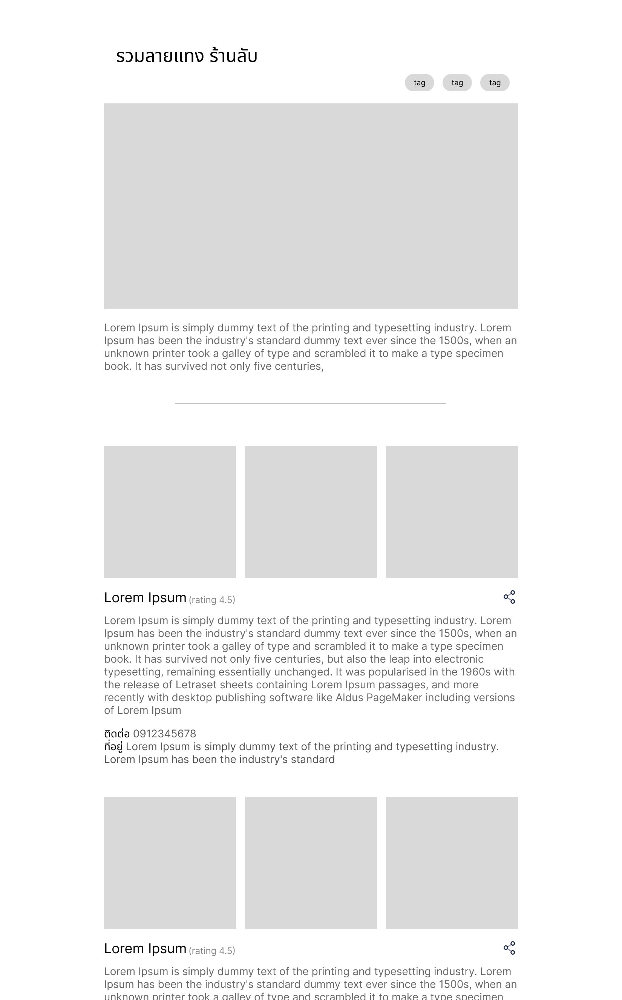

# Frontend Assignment 2025 - รวมลายแทง ร้านลับ

[English version](./README-en.md)

ในแบบทดสอบนี้ ให้ผู้สมัครทำการสร้าง Web Application "รวมลายแทง ร้านลับ" ที่จะเป็นการรวบรวมร้านอาหารต่างๆ เพื่อช่วยให้ผู้ใช้สามารถค้นหาร้านที่ต้องการได้ง่ายขึ้น

**แบบทดสอบนี้มีระยะเวลาในการทำ 7 วัน นับจากวันที่ผู้สมัครได้รับแบบทดสอบผ่านทางอีเมล**

## Prerequisites

- Code editor - ตามที่ผู้สมัครถนัด (แนะนำเป็น [VS Code](https://code.visualstudio.com/), [Cursor](https://cursor.com/))
- NodeJS version 20 ขึ้นไป - (แนะนำให้ติดตั้ง NodeJS ผ่าน version manager อย่างเช่น [์NVM](https://github.com/nvm-sh/nvm))

## Tasks

สำหรับ Web Application "รวมลายแทง ร้านลับ" จะประกอบด้วยกัน 3 อย่าง

1. Data Server - คลังข้อมูลสำหรับรวบรวมข้อมูลลายทางและร้านอาหารทั้งหมดซึ่งทางเราได้เตรียมไว้ให้
2. API Gateway - เป็นตัวกลางที่คอยรวบรวม data จาก service ต่างๆ ก่อนจะส่งกลับมาให้ web สามารถแสดงผลตามต้องการได้ถูกต้อง
3. Web - web สำหรับแสดง UI

ดังนั้นส่วนที่**ผู้สมัครต้องทำ**ในแบบทดสอบนี้จึงมี 2 อย่าง ได้แก่ **Web Application** และ **API Gateway**

### 1. API Gateway

`ปกติแล้ว Frontend ที่ LINE MAN Wongnai นอกจากการทำ web แล้ว ในบางครั้งเราก็จำเป็นต้องทำ API Gateway เองด้วย`

ใน task นี้เราจะต้องสร้าง API Gateway Server ที่ทำหน้าคอย**รวบรวมข้อมูลจาก data server ที่ถูกจัดเตรียมไว้ให้** (ซึ่งจะมีการกล่าวถึง data server ในหัวข้อถัดไป)

**API Gateway สามารถเลือกใช้ ภาษา, framework และ tools ได้ตามความถนัด**

#### Requirements

- [ ] สร้าง endpoint ต่าง ๆ สำหรับส่งข้อมูลกลับไปที่ web โดยที่ web สามารถนำข้อมูลที่ถูกส่งกลับมาใช้แสดงผลตามดีไซน์ที่กำหนดไว้ได้อย่างถูกต้อง และต้องคำนึงถึงข้อผิดพลาดต่างๆ ที่อาจจะเกิดขึ้นได้
- [ ] เขียน unit test เพื่อที่จะมั่นใจได้ว่า API Gateway สามารถทำงานได้อย่างถูกต้อง

### 2. Web

`การสร้าง web application คืองานหลักที่เหล่า Frontend ที่ LINE MAN Wongnai นั้นโปรดปรานสุด ๆ`

ใน task นี้ เราจะต้องสร้าง React web application สำหรับการดูลายแทงร้านอาหาร เพื่อให้ผู้ใช้สามารถค้นหา ร้านที่ตนเองสนใจได้อย่าง่ายดาย



> "จะไปเที่ยวกาญจนบุรี อยากรู้จังแถวนั้นมีร้านอะไรน่าไปบ้าง"

> "เห็นเค้าบอกว่ามัทฉะกำลังฮิตติดกระแสในโซเชียว ไหนดูซิว่ามีร้านมัทฉะอะไรน่าไปบ้าง ขอเป็นแบบร้านเฉพาะทางเลยนะ"

> "จะเลี้ยงรุ่น ไปร้านไหนที่จุคนได้เยอะ ๆ"

**Web Application จะต้องเขียนด้วย React และภาษา Typescript โดยสามารถเลือกใช้ library อื่น ๆ ได้ตามความถนัด**

#### Requirements

สร้าง web application ที่เชื่อมต่อกับ API Gateway สำหรับแสดงผลลายแทงร้านอาหาร **โดยคำนึงถึง UX และ UI ที่ดีต่อผู้ใช้งาน** ทำให้ผุ้ใช้งานรู้สึกได้ว่าการใช้งาน web ของเรานั้นสะดวกสบายและรวดเร็ว

ในลายแทงร้านอาหารสิ่งหลักๆ feature ที่จำเป็นนั้นมีอยู่หลักๆ 2 อย่าง คือ Guide Detail และ Guide Restaurant

**Guide Detail**

- [ ] **ชื่อลายแทง**
- [ ] **คำอธิบาย** เป็นส่วนที่อธิบายว่าลายแทงนี้เกี่ยวกับอะไร มีร้านอาหารแบบไหนบ้างที่อยู่ในลายแทงนี้
- [ ] **แท็ก** เพื่อบอกคำสำคัญที่เกี่ยวข้องกับลายแทงนี้
- [ ] **รูปภาพปก** รูปภาพปกของลายแทง

**Guide Restaurant**

- [ ] รูปภาพประกอบของร้าน
- [ ] ชื่อร้าน
- [ ] คำบรรยายเกี่ยวกับร้านนี้
- [ ] ที่อยู่ร้าน
- [ ] ช่องทางการติดต่อ
- [ ] จำนวนดาว หรือ คะแนน
- [ ] หมวดหมู่ของร้าน

นอกเหนือจาก feature ข้างต้น ผู้สมัครสามารถเพิ่ม feature อื่นๆ ได้อย่างอิสระเพื่อมอบประสบการณ์ที่ดีต่อผู้ใช้งาน และสามารถทำให้ทุคนสามารถเข้าถึงได้โดยไม่มีอุปสรรค

**Coding**

- [ ] เขียน unit test เพื่อที่จะมั่นใจได้ว่า Web application สามารถทำงานได้อย่างถูกต้อง

## Grading Criteria

สำหรับการให้คะแนนแบบทดสอบ เรามีเกณฑ์การพิจารณาหลัก ๆ อยู่ด้วยกันดังนี้

- [ ] Website สามารถทำงานได้ถูกต้องตาม requirement ทั้งหมดที่กล่าวมา
- [ ] Website มี UX/UI ที่ดี ผู้ใช้งานสามารถใช้งาน website ได้อย่างลื่นไหล
- [ ] ความชำนาญในด้าน Javascript, Typescript และ React
- [ ] Good Developer Experience โค้ดที่เขียนมาสามารถทำงานได้อย่างถูกต้อง และสะดวกต่อผู้ที่จะมาพัฒนาด้วยในอนาคต
- [ ] ระบบทั้งหน้าบ้าน (website) และหลังบ้าน (server) ต้องมีประสิทธิภาพที่ดีและมีความปลอดภัย

ทั้งนี้เกณฑ์การพิจารณาอาจจะมีการเปลี่ยนแปลงเพิ่มเติมตามดุลยพินิจของผู้ตรวจ

## Data Server API Specification

สำหรับ data server ภายในจะเป็นเหมือน microservice ต่างๆ ที่ทำหน้าที่แตกต่างกันไป เช่น เก็บข้อมูลของร้านค้า, เก็บข้อมูลลายแทง ซึ่งสามารถเรียกใช้งานได้ผ่านการยิง REST API และสามารถเรียกดูหรือทดลองใช้ API ของแต่ละ service ได้โดยตรงผ่าน Swagger Docs ที่เราได้จัดเตรียมไว้ให้ เมื่อมีการ run data server (link จะถูกระบุไว้ในแต่ละ service)

#### 1. Guide Service

Swagger Docs: http://localhost:8888/ui

service สำหรับเก็บข้อมูลต่างๆ ของลายแทง

##### 1.1 **Guide List**

สำหรับเรียกดูรายการของลายแทง (list of guides) ทั้งหมดที่มีในระบบ

###### Request

- URL: `localhost:8888/guides`
- Method: `GET`

###### Response

- Type: `application/json`
- Body:

  ```ts
  string[]
  ```

  | คำอธิบาย                         |
  | -------------------------------- |
  | รายการ id ของลายแทงทั้งหมดในระบบ |

- Example:

  ```json
  [
    "e1bfd2d3-f0fb-470e-bdd3-be884fdd8dfb",
    "34c790dd-123b-499b-ba55-ea2f5befb452"
  ]
  ```

##### 1.2 **Guide Detail**

สำหรับดูรายละเอียดของลายแทงแต่ละอัน

###### Request

- URL: `localhost:8888/guides/:id`
- Method: `GET`
- Params:
  - `id`: id ของลายแทง (อาจจะได้มากจากการ field `guideIds` ของ API [Guide List](#11-guide-list))

###### Response

- Type: `application/json`
- Body:

  ```ts
  id: string
  title: string
  socialTitle: string
  shortDescription: string
  description: string
  coverPhoto: {
    id: string,
    smallUrl: string
    largeUrl: string
  }
  tags: string[]
  writeDate: string
  createdAt: string
  updatedAt: string
  items: string[]
  ```

  | ชื่อ field            | คำอธิบาย                                                                                        |
  | --------------------- | ----------------------------------------------------------------------------------------------- |
  | `id`                  | id ของลายแทงปัจจุบัน                                                                            |
  | `title`               | หัวข้อของลายแทง                                                                                 |
  | `socialTitle`         | หัวข้อของลายแทง สำหรับกรณีที่ต้องนำไปแสดงผลข้างบอกเว็บไซต์ เช่น social media หรือใช้ในการทำ SEO |
  | `shortDescription`    | คำอธิบายของลายแทงฉบับย่อ                                                                        |
  | `description`         | คำอธิบายของลายแทงฉบับเต็ม                                                                       |
  | `coverPhoto`          | รูปภาพปกของลายแทง                                                                               |
  | `coverPhoto.id`       | id ของรูปภาพ                                                                                    |
  | `coverPhoto.smallUrl` | url ของรูปภาพขนาดเล็ก                                                                           |
  | `coverPhoto.largeUrl` | url ของรูปภาพขนาดใหญ่                                                                           |
  | `tags`                | คำสำคัญที่เกี่ยวข้องกับลายแทงนี้                                                                |
  | `writeDate`           | วันที่เขียนลายแทงนี้                                                                            |
  | `createdAt`           | วันที่ลายแทงนี้ถูกสร้างใน database                                                              |
  | `updatedAt`           | วันที่ลายแทงนี้ถูกแก้ไขครั้งล่าสุด                                                              |
  | `items`               | รายชื่อ id ของ "รายการลายแทง" ทั้งหมด ที่อยู่ในลายแทงนี้                                        |

- Example:

  ```json
  {
    "id": "e1bfd2d3-f0fb-470e-bdd3-be884fdd8dfb",
    "title": "10 คาเฟ่ลับ One Bangkok!",
    "socialTitle": "ไม่อยากจะเชื่อ มีร้านคาเฟ่ดี ๆ แบบนี้ห้างดังย่านลุมพินี One Bangkok ด้วย",
    "shortDescription": "รวมคาเฟ่เด็ดที่ One Bangkok",
    "description": "รวมสุดยอดคาเฟ่ลับ ที่จะพาคุณไปหลงทาง เอ้ย! หลงไหล ในกลิ่นกาแฟอันหอมหวน และ บรรยากาศร้านติดแกรม กินแล้วจะติดใจ",
    "coverPhoto": {
      "id": "63ce2123-b49a-49cc-bc13-80ed802a7894",
      "smallUrl": "http://localhost:7777/r/854/480/20240902_091058.jpg",
      "largeUrl": "http://localhost:7777/r/1920/1080/20240902_091058.jpg"
    },
    "tags": ["กาแฟ", "คาเฟ่", "กรุงเทพ", "One", "Bangkok"],
    "writeDate": "2024-03-10T12:00:00.000Z",
    "createdAt": "2024-03-10T12:00:00.000Z",
    "updatedAt": "2024-03-10T12:00:00.000Z",
    "items": [
      "c77c4d6c-01fa-4e62-8870-563de216a976",
      "a213d622-6649-45b2-9857-ce7f81581256",
      "fed2219f-6dc3-4191-a29d-dd1a15f524ee",
      "da79ad80-6cc0-484d-a574-a84151aba3ef",
      "0209bd16-ca21-4e7f-97e5-888dc20b2896",
      "3cef2b8f-e73e-40d4-9ca5-41fc5b15ca42",
      "9e4ae89a-fd31-4ee0-9378-1d52fb9609a1",
      "c4aa01b9-d123-411a-8b27-b3bf2e159250",
      "f5d95e8f-07c7-4aae-a900-0869ded5c96d",
      "aecd47a3-4e90-494a-afa2-86f0cb692fe9"
    ]
  }
  ```

##### 1.3 **Guide Item**

สำหรับเรียกดูรายการ (ร้านอาหาร) ลายแทงแต่ละอัน

###### Request

- URL: `localhost:8888/guide-items/:id`
- Method: `GET`
- Params:
  - `id`: id ของรายการลายแทง (อาจจะได้มากจาก field `items` ของ API [Guide Detail](#12-guide-detail))

###### Response

- Type: `application/json`
- Body:

  ```ts
  id: string
  description: string
  restaurantId: string
  photos: {
    id: string,
    smallUrl: string
    largeUrl: string
  }[]
  ```

  | ชื่อ field          | คำอธิบาย                                             |
  | ------------------- | ---------------------------------------------------- |
  | `id`                | id ของรายการลายแทง                                   |
  | `description`       | คำอธิบายเกี่ยวกับร้านอาหารของรายการลายแทงนี้         |
  | `restaurantId`      | id ของร้านอาหารที่ผูกกับรายการลายแทงนี้              |
  | `photos`            | รายการของรูปภาพประกอบที่เกี่ยวข้องกับรายการลายแทงนี้ |
  | `photos[].id`       | id ของรูปภาพ                                         |
  | `photos[].smallUrl` | url ของร้านอาหารขนาดเล็ก                             |
  | `photos[].largeUrl` | url ของร้านอาหารขนาดใหญ่                             |

- Example:

  ```json
  {
    "id": "c77c4d6c-01fa-4e62-8870-563de216a976",
    "description": "ONI BUS ร้านสุดลับซ่อนตัวอยู่ที่ไหนก็ไม่รู้",
    "restaurantId": "cea893e7-1893-43ed-8890-f404395572d0",
    "photos": [
      {
        "id": "07595a7a-c2cf-4051-8d11-5c558c8e35fa",
        "smallUrl": "http://localhost:7777/r/480/854/20250205_121426.jpg",
        "largeUrl": "http://localhost:7777/r/1080/1920/20250205_121426.jpg"
      },
      {
        "id": "6fef0249-7ce1-4fc9-aa33-d5bb974d7ce7",
        "smallUrl": "http://localhost:7777/r/480/854/20250205_121840.jpg",
        "largeUrl": "http://localhost:7777/r/1080/1920/20250205_121840.jpg"
      },
      {
        "id": "e11c64cf-d81b-41c1-93d8-de542bb08c44",
        "smallUrl": "http://localhost:7777/r/480/854/20250205_121417.jpg",
        "largeUrl": "http://localhost:7777/r/1080/1920/20250205_121417.jpg"
      },
      {
        "id": "9f01ee78-7589-4290-9ca8-27ede16b4776",
        "smallUrl": "http://localhost:7777/r/480/854/20250205_121414.jpg",
        "largeUrl": "http://localhost:7777/r/1080/1920/20250205_121414.jpg"
      }
    ]
  }
  ```

#### 2. Restaurant Service

Swagger Docs: http://localhost:9999/ui

service ที่เก็บข้อมูลต่างๆ ของร้านอาหาร

##### 2.1 **Restaurant**

###### Request

- URL: `localhost:9999/restaurants/:id`
- Method: `GET`
- Params:
  - `id`: id ของร้านอาหาร (อาจจะได้มากจาก field `restaurantId` ของ API [Guide Detail](#13-guide-item))

###### Response

- Type: `application/json`
- Body:

  ```ts
  id: string
  name: string
  branch?: string
  rating: number
  numberOfReviews: number
  url: string
  address: string
  lat: number
  lng: number
  phoneNo: string
  categories: string[]
  line?: string
  instagram?: string
  facebook?: string
  workingHours: {
    day: number
    open: string
    close: string
  }[]
  official: boolean
  delivery: boolean
  pickup: boolean
  ```

  | ชื่อ field           | คำอธิบาย                                                                                               |
  | -------------------- | ------------------------------------------------------------------------------------------------------ |
  | `id`                 | id ของร้านอาหาร                                                                                        |
  | `name`               | ชื่อร้านอาหาร                                                                                          |
  | `branch`             | ชื่อสาขาของร้านอาหาร                                                                                   |
  | `rating`             | จำนวนดาวของร้านอาหาร ค่าที่เป็นไปได้ ตั้งแต่ 0 - 5                                                     |
  | `url`                | url สำหรับดูร้านอาหารนี้ใน wongnai                                                                     |
  | `address`            | ที่อยู่ของร้านอาหารนี้                                                                                 |
  | `lat`                | ตำแหน่งละติจูดของร้านอาหาร                                                                             |
  | `lng`                | ตำแหน่งลองจิจูดของร้านอาหาร                                                                            |
  | `phoneNo`            | เบอร์โทรศัพท์ที่สามารถติดต่อได้ของร้านอาหาร                                                            |
  | `categories`         | รายชื่อของหมวดหมู่ที่เกี่ยวข้องกับร้านอาหารนี้                                                         |
  | `line`               | id ของ LINE                                                                                            |
  | `instagram`          | id Instagram ของร้าน                                                                                   |
  | `facebook`           | ชื่อเพจ ใน Facebook ของร้าน                                                                            |
  | `workingHours`       | รายการข้อมูลวันทำการของร้าน                                                                            |
  | `workingHours.day`   | วันที่ของสัปดาห์ โดยเริ่มตั้งแต่เลข 1 ก็คือวันจันทร์ และเพิ่มขึ้นไปเรื่อย ๆ จนถึงเลข 7 ก็คือวันอาทิตย์ |
  | `workingHours.open`  | เปิดตั้งแต่เวลาเท่าไหร่ ในรูปแบบ "ชั่วโมง:นาที" แบบ 24 ชั่วโมง                                         |
  | `workingHours.close` | ปิดเมื่อเวลาเท่าไหร่ ในรูปแบบ "ชั่วโมง:นาที" แบบ 24 ชั่วโมง                                            |
  | `official`           | ร้านนี้เป็นร้าน official หรือไม่                                                                       |
  | `delivery`           | ร้านนี้เปิดใช้งานระบบ delivery หรือไม่                                                                 |
  | `pickup`             | ร้านนี้เปิดใช้งานระบบ pickup หรือไม่                                                                   |

- Example:

  ```json
  {
    "id": "cea893e7-1893-43ed-8890-f404395572d0",
    "name": "ONIBUS COFFEE",
    "rating": 4.29,
    "numberOfReviews": 6,
    "url": "https://www.wongnai.com/restaurants/2179285Ss-onibus-coffee-bangkok",
    "address": "22, สำราญราษฎร์ สำราญราษฎร์ พระนคร กรุงเทพมหานคร",
    "lat": 13.752888635769,
    "lng": 100.5034106411,
    "phoneNo": "0939164541",
    "categories": ["ร้านกาแฟ/ชา"],
    "instagram": "onibuscoffee_bkk",
    "workingHours": [
      {
        "day": 1,
        "open": "08:00",
        "close": "17:00"
      },
      {
        "day": 2,
        "open": "08:00",
        "close": "17:00"
      },
      {
        "day": 3,
        "open": "08:00",
        "close": "17:00"
      },
      {
        "day": 4,
        "open": "08:00",
        "close": "17:00"
      },
      {
        "day": 5,
        "open": "08:00",
        "close": "17:00"
      },
      {
        "day": 6,
        "open": "08:00",
        "close": "17:00"
      },
      {
        "day": 7,
        "open": "08:00",
        "close": "17:00"
      }
    ],
    "official": true,
    "delivery": true,
    "pickup": true
  }
  ```

## Run project

เราได้ทำการเตรียมโปรเจค web และ api-gateway รวมถึง script ไว้ให้เบื้องต้นแล้ว ซึ่งผู้สมัครสามารถ run project ได้ตามวิธีการด้านล่าง

1. Install dependencies ทั้งหมด

   ```sh
   pnpm install
   ```

2. Run project ทั้งหมด

   ```sh
   pnpm run -r dev
   ```

## FAQ

### 1. สามารถแก้ไขอะไรได้บ้างใน project ที่ได้รับมา?

สามารถแก้ได้อย่างอิสระ โดยที่ยังทำตาม requirement ที่กำหนดมาให้ได้ และสามารถ run ได้สำเร็จ

### 2. สามารถใช้ library หรือ framework อื่นๆ ได้ไหม?

สามารถใช้ library, framework หรือปรับแต่งอะไรโปรเจคก็ได้ตามอิสระ

### 3. สามารถใช้ Agent หรือ AI ช่วยเขียนได้ไหม?

สามารถใช้ได้ตามสะดวก เพราะในปัจจุบัน frontned เราๆ ก็ใช้เพื่อเพิ่ม productivity ให้แก่ product ของเรา

### 4. ถ้าใช้เวลาทำแบบทดสอบนานเกินกำหนดจะยังส่งแบบทดสอบได้ไหม?

มีหลายๆ ครั้งที่ผู้สมัครไม่มีเวลาในการทำบ้าน ทำให้ทำการบ้านไม่ทัน ดังนั้นขอแค่บอกล่วงหน้าหรือบอกเหตุผล ในหลายๆ ครั้งเราก็จะยืดหยุ่นเรื่องเวลาในการทำให้

### 5. ถ้า zip การบ้านแล้วไม่สามารถส่งผ่านช่องทางที่เรากำหนดได้จะทำยังไง?

สามารถอัพขึ้นคลาวด์แล้วแนบลิงค์ download มาให้ในอีเมล์ได้ (แต่แนะนำว่าควรลองส่งมายังช่องทางที่จัดเตรียมไว้ให้ก่อน)
